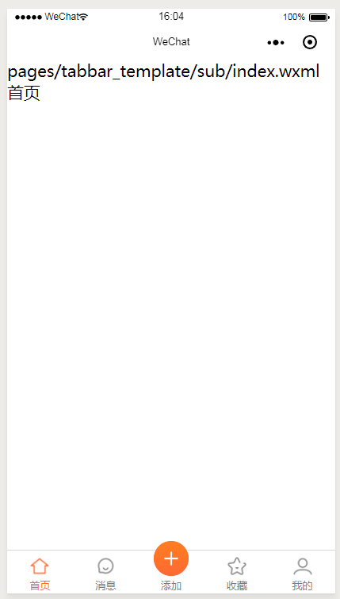

## 小程序自定义tabbar ##

> **代码片段**： [wechatide://minicode/IUoCyemJ7D3d](wechatide://minicode/IUoCyemJ7D3d)
> 
> **GitHub**: [https://github.com/WozHuang/Miniprogram-Demo/tree/master/custom-tabbar](https://github.com/WozHuang/Miniprogram-Demo/tree/master/custom-tabbar)

在项目中要求用tabbar，奈何老板嫌微信自带的tabbar太丑而且功能也不够丰富，因此需要自定义tabbar，没办法就只能自己重新造一个，在造轮子之前从网上找了不少但都是直接使用navigateTo或者redirectTo实现跳转功能，每次都重新加载一下页面实在是受不了。

在细读了微信的api文档后发现能够使用**hideTabBar**这个方法将原有的tabbar隐藏掉，这样只要自己重新写一个tabbar就可以了

### 优点： ###

1. 自定义更好看的tabbar

2. 相比其他用navigateTO实现的tabbar效果更好（没有页面跳转）

3. 可以自定义页面跳转方式，比如第三个按钮的目标页面是一个二级页面，不需要tabbar

### 缺点： ###

1. 相比于原生的tabbar，首次进入页面的时候需要加载tabbar，导致初次切换到页面的时候tabbar会闪烁一下，视觉效果差点

注：可以考虑在单页面中引入多个页面来避免闪烁的问题，但是这样开发的复杂度会高不少

### 效果图： ###

### 实现原理 ###

1. 利用 `wx.hideTabBar({aniamtion: false})` 隐藏默认的tabbar

2. 点击时使用 `wx.switchTab` 进行跳转

### 2019-1-21 更新 ###

小程序有时ios下tabbar没有隐藏，为了保险起见在组件的生命周期内调用了多次 `wx.hideTabBar`

### 2019/1/22 更新 ###

发现在ios下，在小程序全屏播放视频后回到页面内时tabbar会再次出现，因此如果有全屏播放视频的需求的话需要在视频对象的 `bindfullscreenchange` 事件中再次调用 `wx.hideTabBar({aniamtion: false})` 

（我不管，反正这是微信ios端的锅，不是我的代码有问题 ヽ(ｏ`皿′ｏ)ﾉ ）