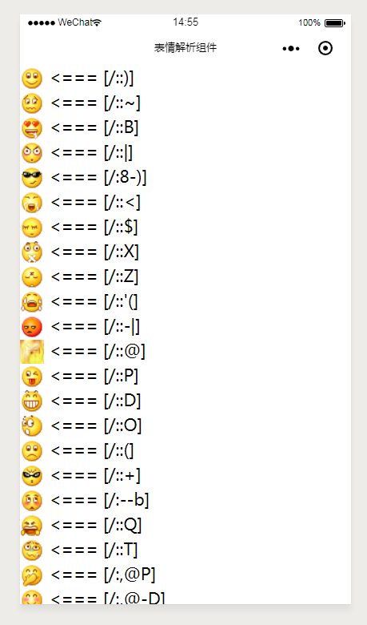

## 小程序QQ表情解析组件 ##

> **代码片段**： [https://developers.weixin.qq.com/s/KLaD5MmD7V45)
> 
> **GitHub**: [https://github.com/WozHuang/Miniprogram-Demo/tree/master/emoji-parser](https://github.com/WozHuang/Miniprogram-Demo/tree/master/emoji-parser)

本来有人提出要使用表情的时候并不需要做那么多功能，因为`utf8`字符集中本来就已经定义有表情了，我只要将mysql的字符集改成`utf8mb4`就可以实现预期的功能。

但是后来又有人嫌弃那个表情丑（我懒得告诉他是因为安卓版本低系统自带的emoji才这么难看，苹果华为的可好看了）

于是就计划实现一个自定义表情的功能（目前只做了微信那种小表情，大表情图暂时没考虑，因为已经做发送图片的功能），一顿寻找资源加思考后做了一个能够将设定的字符替换成图片的组件。

> 参考博客:
> 
> https://blog.csdn.net/frankcheng5143/article/details/64129433
> 
> 表情&表情code来源:
> 
> https://www.oschina.net/code/snippet_146430_27448

### 优点： ###

1. 避免使用系统自带的emoji，省的老有人说丑，再嫌丑的话就让他自己去设计表情反正我给你放进去

### 缺点： ###

1. 因为是使用图片替换的表情，图片的像素对表情的清晰度有影响，缩放下有时候会出现模糊

2. 使用了组件的方式将字符解析成表情，在硬件条件不佳的情况下可能会影响使用体验

### 实现原理 ###

#### 核心： ####

使用`[xxx]`的形式代表表情

#### 组件解析过程 ####

1. 将输入的字符串使用正则 `/\[[^\[\]]*?\]/g` 切割出字符串中 `'[xxx]'` 形式的字符串，得到字符串数组
	
	**输入字符串：** `'你真是太[xxx]了'`
	
	**切割后得到的字符串数组：** `['你真是太', '[xxx]', '了']`
	
	这里 `'[xxx]'` 对应的可能是某一个表情

2. 循环字符串数组，如果能够找到 `'[xxx]'` 对应的表情则显示为一个有对应背景图的 `` 标签，不是 `'[xxx]'` 格式和找不到对应表情的字符串则原样显示

	

### 效果图： ###

